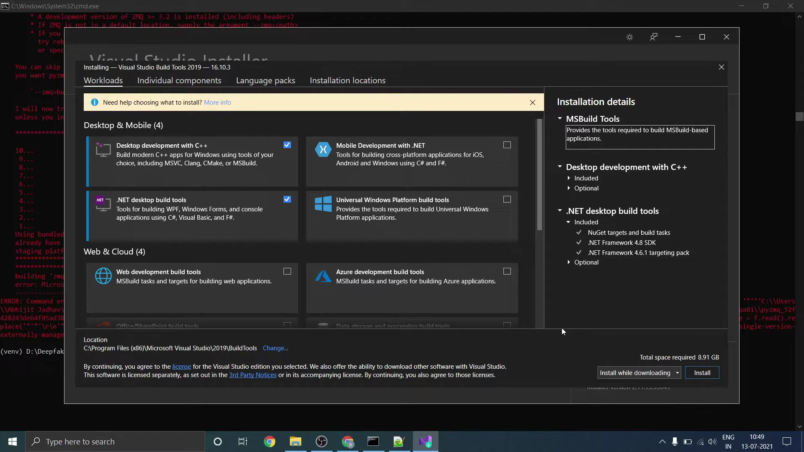

# Deep fake detection Django Application

## Requirements:

**Note :** Nvidia GPU is mandatory to run the application.

You can find the list of requirements in [requirements.txt](https://github.com/Goutam-04/Deep-Fake/blob/main/requirements.txt). Main requirements are listed below:

```
Python >= v3.6
Django >= v3.0
```

## Directory Structure

- ml_app -> Directory containing code in views.py file

- project_settings -> Contains Django settings
- static -> Contains all css, js and json files
- templates -> Template files for HTML


## Prerequisite
1. Copy your trained model to the models folder.
   - You can download our trained models from the [Google Drive](https://drive.google.com/drive/folders/1K85O_EpuyY_BkWmpXdafLP4lMKqYKL7p?usp=sharing) or you can train your models using the steps mentioned in Model Creation branch of this repo.

### Step 1 : Clone the repo and Navigate to Django Application

`git clone https://github.com/Goutam-04/Deep-Fake.git`

<b>Note:</b> If wsl is there in your pc ,then stop it by following the steps <strong>open task manager -->search WSL --> end task </strong> 

### Step 2: Install python 

-Download the python v3.6.8 from  [Here](https://www.python.org/downloads/release/python-368/) and install it.


### Step 3: Upgrade pip

`pip install --upgrade pip`

### Step 4: Create virtualenv 

`python -m venv venv`

### Step 5: Activate virtualenv 

`venv\Scripts\activate`

### Step 6: Install pytorch 

`pip install torch==1.9.0+cu111 torchvision==0.10.0+cu111 torchaudio==0.9.0 -f https://download.pytorch.org/whl/torch_stable.html`

### Step 7: Install Visual Studio

-Download the Visual Studio from  [Here](https://visualstudio.microsoft.com/thank-you-downloading-visual-studio/?sku=Community&channel=Release&version=VS2022&source=VSLandingPage&workload=githubcopilot&cid=3601&passive=false) and install it.

-then open Visual Studio and install the two things that are checked in the pic
<p align="center">
  
</p>

### Step 8: Install CMake 

-Go to this [site](https://cmake.org/files/v3.16/) and find cmake-3.16.3-win64-x64.msi and download and install it.

### Step 9: Install requirements

`pip install requirements.txt`

### Step 10: Copy Models

`Copy your trained model to the models folder`

- You can download our trained models from [Google Drive](https://drive.google.com/drive/folders/1K85O_EpuyY_BkWmpXdafLP4lMKqYKL7p?usp=sharing)


**Note :** The model name must be in specified format only i.e *model_84_acc_10_frames_final_data.pt*. Make sure that no of frames must be mentioned after certain 3 underscores `_` , in the above example the model is for 10 frames.


### Step 11: Run project

`python manage.py runserver`


